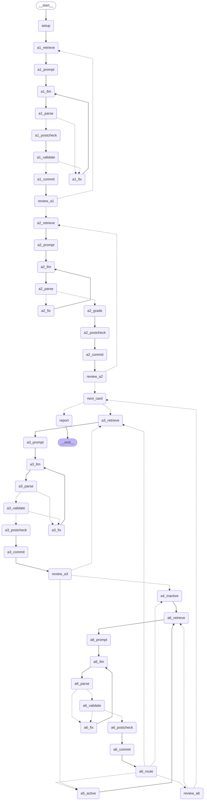

# Person 3 graph

```mermaid
---
config:
  flowchart:
    curve: linear
---
graph TD;
	__start__([<p>__start__</p>]):::first
	setup(setup)
	a1_retrieve(a1_retrieve)
	a1_prompt(a1_prompt)
	a1_postcheck(a1_postcheck)
	a1_commit(a1_commit)
	a1_llm(a1_llm)
	a1_parse(a1_parse)
	a1_fix(a1_fix)
	a1_validate(a1_validate)
	review_a1(review_a1)
	a2_retrieve(a2_retrieve)
	a2_prompt(a2_prompt)
	a2_postcheck(a2_postcheck)
	a2_commit(a2_commit)
	a2_llm(a2_llm)
	a2_parse(a2_parse)
	a2_fix(a2_fix)
	a2_grade(a2_grade)
	review_a2(review_a2)
	next_card(next_card)
	a3_retrieve(a3_retrieve)
	a3_prompt(a3_prompt)
	a3_postcheck(a3_postcheck)
	a3_commit(a3_commit)
	a3_llm(a3_llm)
	a3_parse(a3_parse)
	a3_fix(a3_fix)
	a3_validate(a3_validate)
	review_a3(review_a3)
	a4_inactive(a4_inactive)
	a5_active(a5_active)
	a6_retrieve(a6_retrieve)
	a6_prompt(a6_prompt)
	a6_postcheck(a6_postcheck)
	a6_commit(a6_commit)
	a6_llm(a6_llm)
	a6_parse(a6_parse)
	a6_fix(a6_fix)
	a6_validate(a6_validate)
	a6_route(a6_route)
	review_a6(review_a6)
	report(report)
	__end__([<p>__end__</p>]):::last
	__start__ --> setup;
	a1_commit --> review_a1;
	a1_fix --> a1_llm;
	a1_llm --> a1_parse;
	a1_parse -.-> a1_fix;
	a1_parse -.-> a1_postcheck;
	a1_postcheck --> a1_validate;
	a1_prompt --> a1_llm;
	a1_retrieve --> a1_prompt;
	a1_validate -.-> a1_commit;
	a1_validate -.-> a1_fix;
	a2_commit --> review_a2;
	a2_fix --> a2_llm;
	a2_grade --> a2_postcheck;
	a2_llm --> a2_parse;
	a2_parse -.-> a2_fix;
	a2_parse -.-> a2_grade;
	a2_postcheck --> a2_commit;
	a2_prompt --> a2_llm;
	a2_retrieve --> a2_prompt;
	a3_commit --> review_a3;
	a3_fix --> a3_llm;
	a3_llm --> a3_parse;
	a3_parse -.-> a3_fix;
	a3_parse -.-> a3_validate;
	a3_postcheck --> a3_commit;
	a3_prompt --> a3_llm;
	a3_retrieve --> a3_prompt;
	a3_validate -.-> a3_fix;
	a3_validate -.-> a3_postcheck;
	a4_inactive --> a6_retrieve;
	a5_active --> a6_retrieve;
	a6_commit --> a6_route;
	a6_fix --> a6_llm;
	a6_llm --> a6_parse;
	a6_parse -.-> a6_fix;
	a6_parse -.-> a6_validate;
	a6_postcheck --> a6_commit;
	a6_prompt --> a6_llm;
	a6_retrieve --> a6_prompt;
	a6_route -.-> a3_retrieve;
	a6_route -.-> a4_inactive;
	a6_route -.-> a5_active;
	a6_route -.-> review_a6;
	a6_validate -.-> a6_fix;
	a6_validate -.-> a6_postcheck;
	next_card -.-> a3_retrieve;
	next_card -.-> report;
	review_a1 -.-> a1_retrieve;
	review_a1 -.-> a2_retrieve;
	review_a2 -.-> a2_retrieve;
	review_a2 -.-> next_card;
	review_a3 -.-> a3_retrieve;
	review_a3 -.-> a4_inactive;
	review_a3 -.-> a5_active;
	review_a6 -.-> a6_retrieve;
	review_a6 -.-> next_card;
	setup --> a1_retrieve;
	report --> __end__;
	classDef default fill:#f2f0ff,line-height:1.2
	classDef first fill-opacity:0
	classDef last fill:#bfb6fc
```
